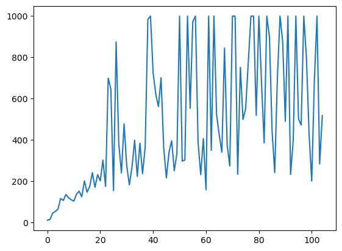

# Results
The results for all four methods are shown below:

#### Hill Climbing

#### Steepest Ascent Hill Climbing

#### Simulated Annealing

#### Adaptive Noise Scaling

### Conclusion
For this environment, the __steepest ascent hill climbing__ method seems 
to work the best.